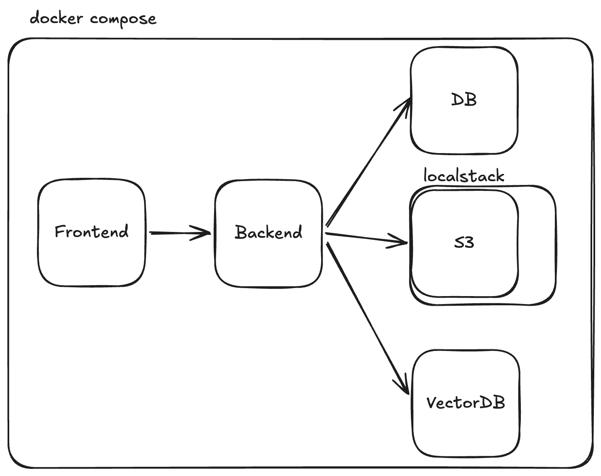

# NotebookLM

A chat-with-documents application built with FastAPI, LangGraph, React, and Vite.

## Architecture



## Quick Start

### Prerequisites

- [Docker](https://docs.docker.com/get-docker/) and Docker Compose

### 1. Backend environment (required)

Create a `.env` file in the `backend` folder using the example as a template:

```bash
cp backend/.env.example backend/.env
```

Edit `backend/.env` with your credentials. Treat `.env` as a secret: do not commit it to version control. Use `.env.example` as a template for required variables.

### 2. Run with Docker Compose

From the project root

```bash
# Start all services (LocalStack, FastAPI backend, frontend)
docker compose up -d

# Or run in foreground to see logs
docker compose up
```

- **Backend API**: http://localhost:8000  
- **Frontend**: http://localhost:5173  
- **LocalStack (S3)**: http://localhost:4566  

### 3. Stop services

```bash
# Stop all containers
docker compose down
```

### 4. Clean (remove containers and volumes)

From the project root:

```bash
# Stop and remove containers, networks, and volumes
docker compose down -v

# Optional: remove local data (LocalStack, SQLite DB, ChromaDB)
rm -rf localstack_data
rm -f backend/database.db
rm -rf backend/chroma_db
```

---

## Project structure

| Folder | Description |
|--------|-------------|
| **`backend`** | FastAPI application with LangGraph agents, document upload (S3 via LocalStack), embeddings, and chat streaming. |
| **`frontend`** | Vite + React app. Uses a dev proxy: requests to `/api` are forwarded to the backend. |
| **`endpoints_collections`** | Bruno API collections for testing backend endpoints. |
| **`llms`** | LLM transcripts and code-generation history for reference. |
| **`.cursor`** | Custom Cursor rules to improve LLM-assisted coding quality. |

### Frontend proxy

The frontend proxies `/api` to the backend. In `vite.config.ts`:

- Requests to `/api/*` are rewritten to `/*` and sent to the backend.
- This avoids CORS when the frontend runs on a different port than the API.

---

## Cursor rules

The `.cursor/rules/` directory holds project-specific rules for Cursor:

- **`frontend-vite-react.mdc`** — Vite, React, and frontend structure
- **`backend-fastapi-langchain.mdc`** — FastAPI and LangChain conventions
- **`backend-code-quality.mdc`** — Python quality, DRY, and docstrings

These rules help the IDE produce more consistent and higher-quality suggestions.
